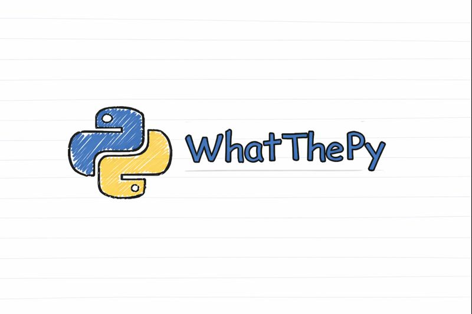

<p align="center">
  
  
  
</p>

<p align="center">
  
</p>

<h3 align="center">
  <sub>People kept telling me my code looked bad. So I wrote a tool to make it worse (on purpose)</sub>
</h3>

---

## What Is This?

**WhatThePy** takes your Python source code and wraps it in layers of compression, encoding, and XOR to make it look intimidating. It:

- **Compresses** your source with zlib
- **XORs** it with a random key
- **Encodes** everything in Base85
- **Scatters** the payload into 30-40+ random chunks
- **Adds** fake functions and decoy data

The result? Code that **looks** scary but still runs perfectly.

**Important:** This is a fun project for learning and deterring casual viewers. It's not real cryptography or serious protection - anyone with reverse engineering skills can unpack this. If you need actual security, use Cython, Nuitka, or even better, accept that all client side code is reversible!!.

---

## Before & After

<table>
<tr>
<th>Your Code</th>
<th>After WhatThePy</th>
</tr>
<tr>
<td>

```python
def greet(name):
    message = f"Hello, {name}!"
    print(message)
    return message

if __name__ == "__main__":
    greet("World")
```

</td>
<td>

```python
import sys, os
from typing import Optional, Any

def validate_DWAs(config):
    cache = {}
    def inner(k, v=None):
        if v is None:
            return cache.get(k)
        cache[k] = v
        return v
    return inner

_1lI1l011O10I = 'JhB*_JaV{tPLHbz8(I?pI'
_100I000IO1Ol = 'K(rv|g_mQ135Kynv>@p>k'
# ... 40+ more chunks ...

_l01I0Ol0OOl0 = [_1lI1l011O10I,_100I000IO1Ol,...]
_O1Ol0O1IO1IO = b'\xf0\xf1\xc3\x15\x1dp...'
_OIO1l101I1I0 = ''.join(_l01I0Ol0OOl0)

exec(__import__('zlib').decompress(
    (lambda d,k:bytes(a^b for a,b in zip(d,
        __import__('itertools').cycle(k))))(
            __import__('base64').b85decode(
                _OIO1l101I1I0),_O1Ol0O1IO1IO))
    .decode('utf-8'))
```

</td>
</tr>
</table>

---

## Installation

```bash
git clone https://github.com/txvch/WhatThePy.git
cd WhatThePy
pip install -r requirements.txt
```

**Requirements:**
- Python 3.8+
- `rich` - Beautiful terminal output
- `pyfiglet` - ASCII art banner

---

## Usage

```bash
python -m whatthepy
```

You'll see:

```
 _       ____          __ ________         ____
| |     / / /_  ____ _/ //_  __/ /_  ___  / __ \__  __
| | /| / / __ \/ __ `/ __// / / __ \/ _ \/ /_/ / / / /
| |/ |/ / / / / /_/ / /_ / / / / / /  __/ ____/ /_/ /
|__/|__/_/ /_/\__,_/\__//_/ /_/ /_/\___/_/    \__, /
                                             /____/

Compress -> Encrypt -> Scatter

File path: mycode.py
→ mycode.py (648 B)

---------------------------------------- Done

✓ Saved to mycode_obfuscated.py
  648 B → 2.7 KB | 14 chunks | 4 decoys

pyinstaller --onefile mycode_obfuscated.py
```

Your obfuscated file is saved as `yourfile_obfuscated.py`.

---

## How It Works

```
┌─────────────────┐
│  Your Code.py   │
└────────┬────────┘
         │
         ▼
┌─────────────────┐
│ Compress        │  ← zlib level 3
│ (zlib)          │
└────────┬────────┘
         │
         ▼
┌─────────────────┐
│ Encrypt         │  ← XOR with random 16-byte key
│ (XOR)           │
└────────┬────────┘
         │
         ▼
┌─────────────────┐
│ Encode          │  ← Base85 encoding
│ (Base85)        │
└────────┬────────┘
         │
         ▼
┌─────────────────┐
│ Scatter         │  ← Split into 30-40+ random chunks
│ Payload         │    Mixed with fake code & decoys
└────────┬────────┘
         │
         ▼
┌─────────────────┐
│ "Protected".py  │  ← Runs exactly like the original
└─────────────────┘
```

---

## What This Protects Against

| Threat Level | Protected? |
|--------------|-----------|
| **Script kiddies** | ✅ Yes |
| **Casual copy-paste** | ✅ Yes |
| **Absolute beginners** | ✅ Yes |
| **Quick glances** | ✅ Yes |
| **Motivated attackers** | ❌ No |
| **Static analysis tools** | ❌ No |
| **Anyone who knows what they're doing** | ❌ No |

---

## PyInstaller Ready

The obfuscated code works with PyInstaller:

```bash
python -m whatthepy
# Enter: myapp.py

pyinstaller --onefile myapp_obfuscated.py

./dist/myapp_obfuscated
```

---

## When To Use This

**Good for:**
- Learning how packing works
- Deterring casual viewers
- Fun projects
- CTF challenges
- "Please don't casually read this"

**Not good for:**
- Protecting valuable IP
- License enforcement
- Hiding secrets or API keys
- Anything you actually care about

---

## Limitations

- File size increases due to encoding and fake code
- Slightly slower runtime from decompression overhead
- Python 3.8+ only
- Not actual security (just deterrence)

---

## Disclaimer

This is a fun project for learning and experimentation. It makes code harder to casually read but doesn't provide serious protection. Use it for fun, learning, or light deterrence - not for anything critical.

Made this as a weekend project and please.. Don't use it for serious security needs!

---

## License

MIT License - Do whatever you want with it.

---

<p align="center">
  <sub>Made with questionable decisions and too much redbull😭</sub>
</p>
